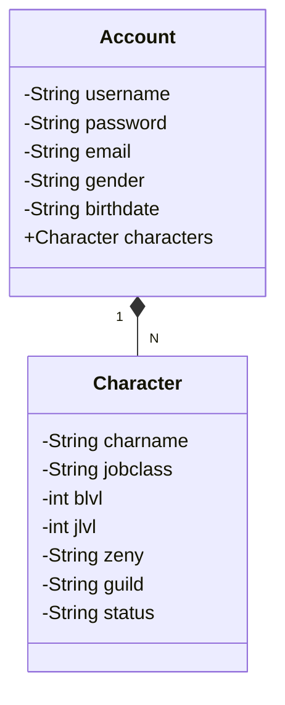

## Bootcamp Santander Java Backend Developer
API RESTful Java para CRUD de conta de Ragnarok Online em um Banco de Dados.

Projeto desenvolvido utilizando Java e Spring Framework.

## Diagrama de Classes

